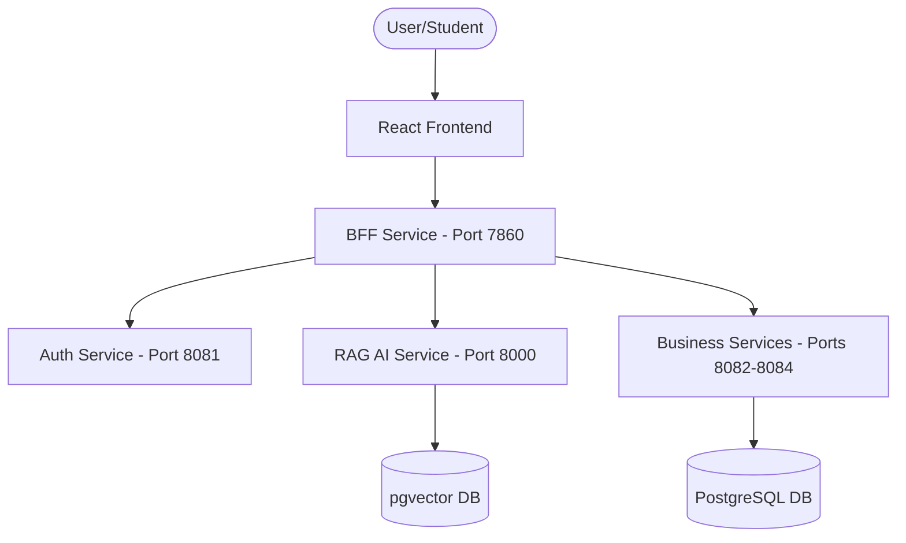
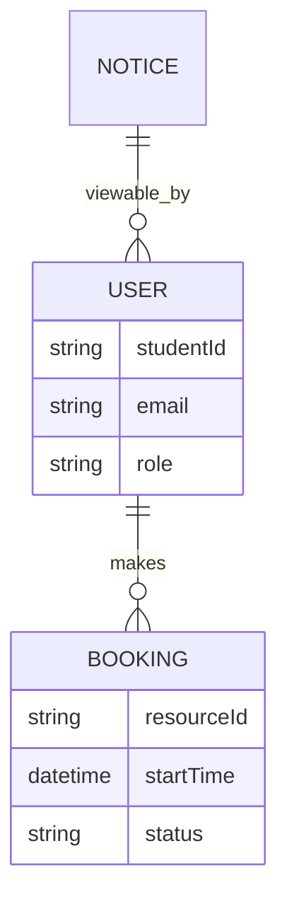

# Campus Buddy - Project Report & Presentation Guide

## 1. Introduction
**Campus Buddy** is a comprehensive campus management and student assistance platform designed to streamline academic administrative tasks and provide AI-driven assistance to students and faculty. The system integrates multiple microservices to handle authentication, academic records, campus notices, and facility bookings through a unified Gateway (BFF).

## 2. Objective
- To provide a centralized portal for students to manage their campus life.
- To use AI (RAG - Retrieval Augmented Generation) to answer campus-related queries.
- To eliminate fragmented communication between departments using specialized microservices.

## 3. Technology Stack
- **Frontend**: React.js (Vercel)
- **Backend Architecture**: Microservices (Spring Boot)
- **AI Brain**: Python FastAPI + LangChain + Google Gemini API
- **Database**: PostgreSQL (Neon.tech)
- **Deployment**: Hugging Face Spaces (Dockerized)

## 4. System Design

### High-Level Flow

### Entity Relationship Diagram (Simplified)

## 5. Implementation Details
- **Unified Startup**: Implemented a specialized `start-all.sh` with port-synchronization loops to ensure 99.9% uptime on Hugging Face.
- **Production Hardening**: Customized CORS policies for Vercel and Neon.tech schema-less connectivity for instant deployment.
- **Self-Healing AI**: Integrated model discovery to automatically select the best Google Gemini model available.

## 6. Table Description
- **Users**: Stores `id`, `student_id`, `email`, `password_hash`, `role`.
- **Notices**: Stores `id`, `title`, `content`, `category`, `created_at`.
- **Academic**: Stores `course_id`, `marks`, `attendance`.

## 7. Outcomes & Conclusion
The project successfully demonstrates a modern, scalable cloud-native architecture. By using AI, **Campus Buddy** reduces the administrative burden on faculty and provides 24/7 support to students.

## 8. Bibliography
- Spring Microservices in Action (John Carnell)
- Generative AI with LangChain (Documentation)
- React.js: State Management and Hooks
